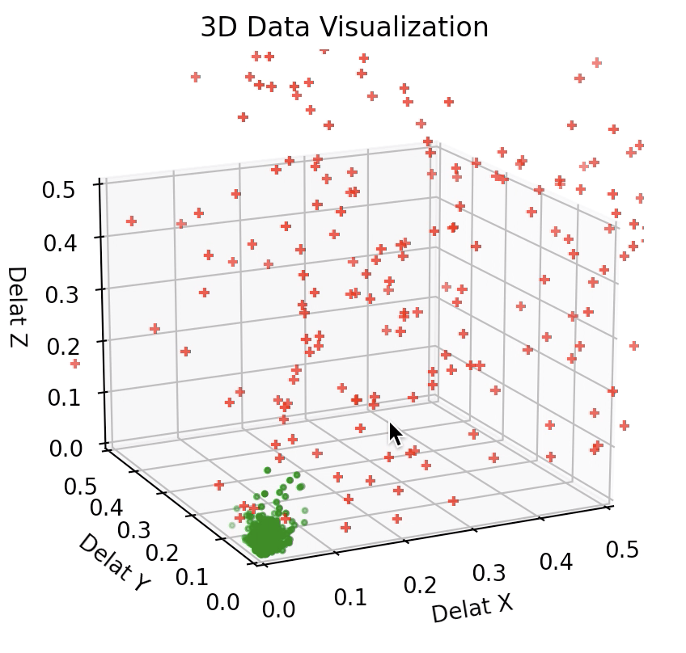

# Human Activitiy Binary Classification

This project aims to classify the human activity based on 3-axial linear acceleration and 3-axial angular velocity. 

The data was collected at a constant rate in various scenarios using the Android Motion Sensor. 

Several models were adopted to make comparisons:
- Decision Tree
- KNN
- Linear Regression
- Naive Bayes
- Support Vector Machine
- Multi-layer Perceptron
- Threshold (Non-maching-learning approach)

